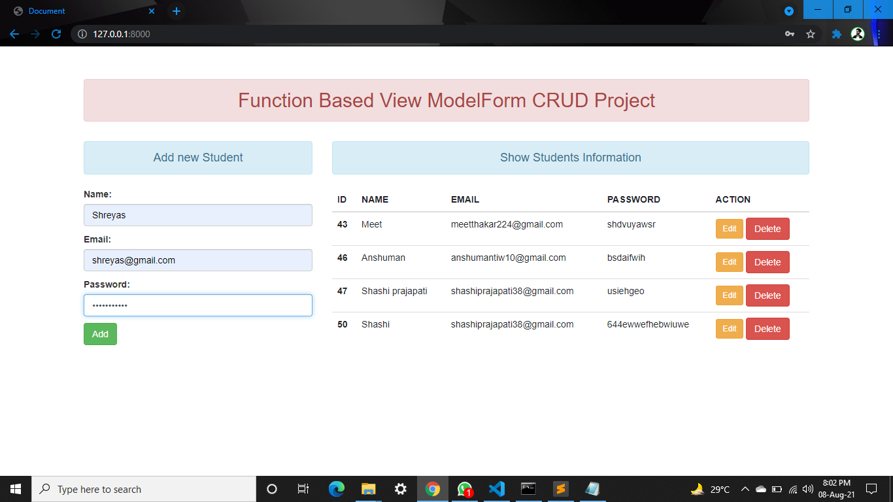
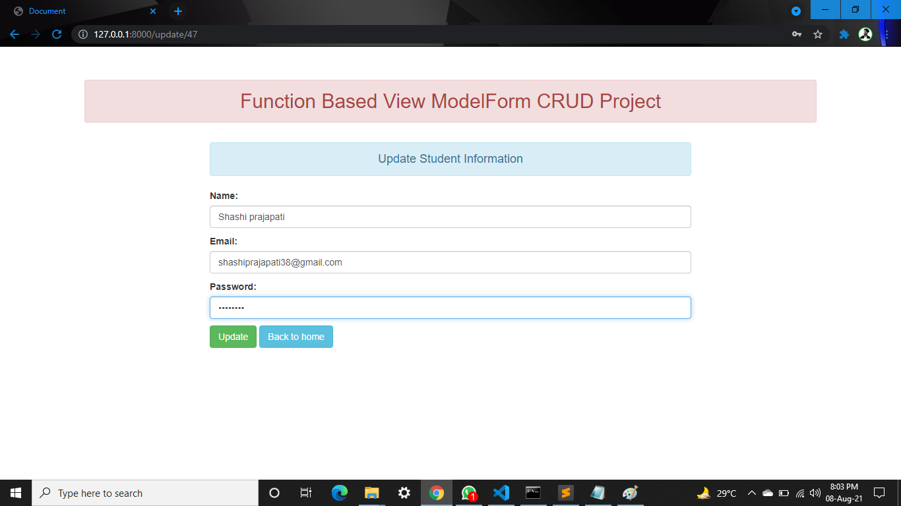
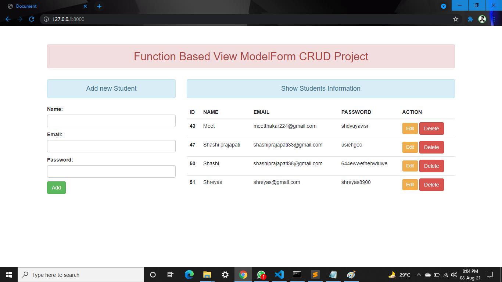

# CRUD-Project
CRUD Project || Django || Python || MySQL

======== ***Project Live*** ===========  
**This Project is live on Heroku-- ** 
Follow this below link to view this Project Live.
***http://crud-project46.herokuapp.com/***

 ======== ***CRUD Project*** ===========  

**CRUD (create, read, update and delete)** Project built over Django which is Function Based View ModelForm CRUD Project.
 

======== ***1. Create [Add to the Database]*** ===========  

======== ***2. Update [Update already exiting Database]*** ===========  

======== ***3. Delete [Delete from the Database]*** ===========  

======== ***Thank You.......*** ===========  

